# Build your own 1D Cellular Automata
By [Julian Ceipek](https://jceipek.com/) and [Behnaz Farahi](http://www.behnazfarahi.com/).

# What is a Cellular Automaton?

A cellular automaton is a computational model that consists of a grid of cells with a finite number of states (such as “on” and “off”). The state of each cell changes over time based on a set of rules that involve the current state of the cell and its neighbors.

Cellular automata come in many different forms and have applications in all sorts of different fields, including random number generation, physics, and biology. They also make pretty patterns.

Assuming you have a bit of programming experience, by the end of this tutorial, you'll know how to program your own 1D cellular automata in C, and will also have a working understanding of binary numbers, modular arithmetic, pointers, and bitwise arithmetic.

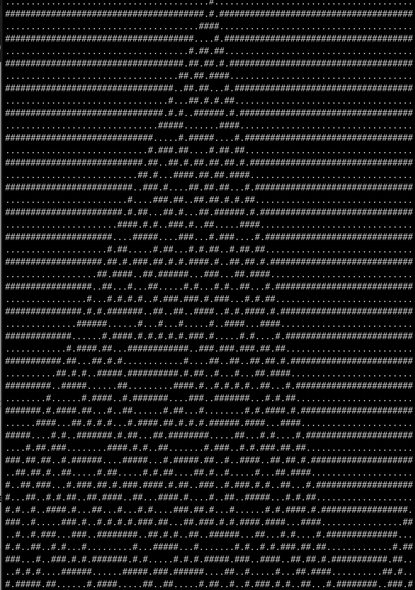

If that sounds interesting, let's get started!

# 1D Cellular Automata

1D Cellular Automata are among the simplest Cellular Automata. 1D refers to the grid’s number of dimensions: the grid is a line of cells that each has one of two states: live (1) or dead (0). We think of time advancing forward by one step at a time. The state of each cell at time `t` is based on the state of that cell and the cells to its left and right at time `t-1`.

If we visualize a 1D cellular automata as a 2D grid where the horizontal axis represents time and each row represents the state of each cell at that time, we can see some interesting patterns emerge:

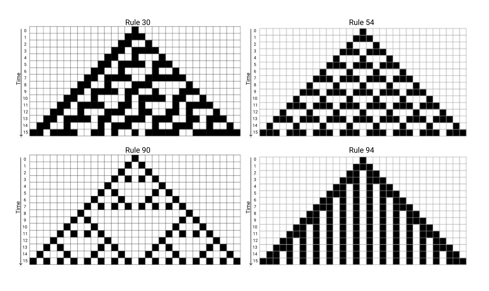

Above you can see several 1D cellular automata visualized over time, with filled cells representing state `1` and empty cells representing state `0`. Note how different each of them looks! While each started with the same initial state, they quickly diverge from one another, because the rules for each automaton are different.

We said that the state of each cell at time `t` depends on its state and that of its direct neighbors at `t-1`. We can visualize that relationship with a "T" shape, like this:

<p align="center">
  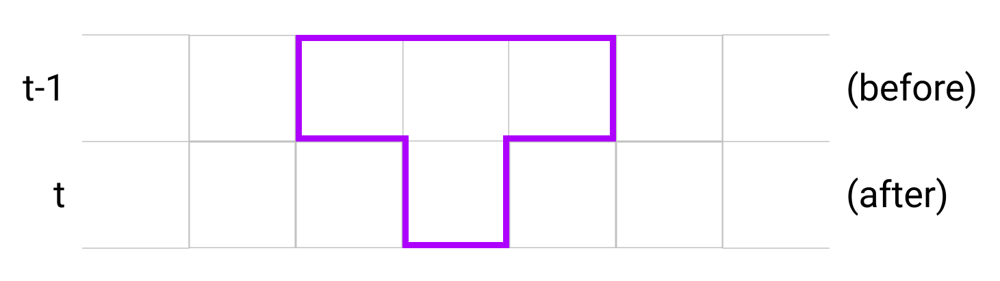
</p>

<p align="center">
   1">
</p>

An automaton's rule expresses what state the "after" cell (at time `t`) should be in given the 3 "before" states (at `t-1`), for all possible configurations of those states. For example, a rule might include the subrule "if I am `0` and my left and right neighbors are `1`, I should become `1`":

<p align="center">
  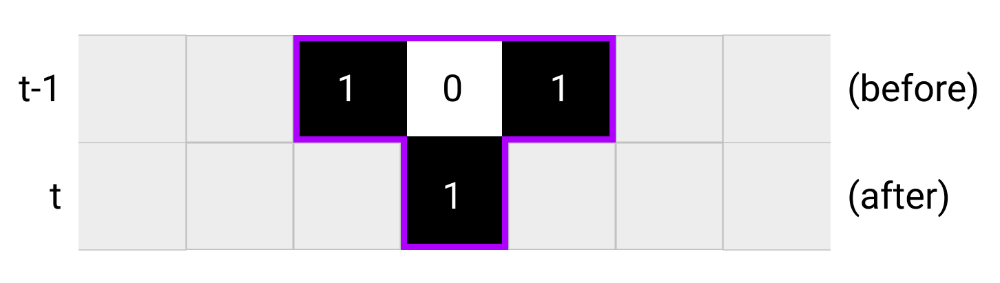 1) annotated with numbers">
</p>

Each subrule has two parts: a "before" state and an "after" state.

- Let's try to figure out how many subrules a 1D cellular automaton needs in order to cover *every* possible "before" state. Here's a hint: each subrule's before state includes the state of 3 cells, and each individual cell has two possible states, 0 and 1.

    Solution:

    If the before state involved just one cell, there would be two possible before states, 0 and 1:

    <p align="center">
      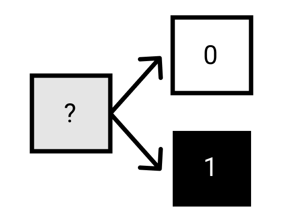
    </p>

    Adding a cell adds two additional possibilities for each of the previous possibilities:

    <p align="center">
      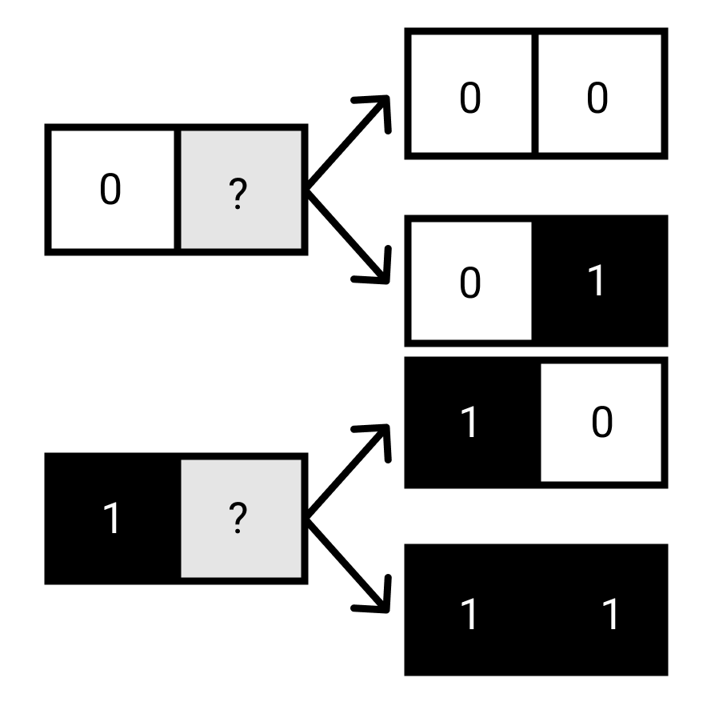
    </p>

    By the same logic, adding a third cell doubles the possibilities yet again, which gives us <b>2&#215;2&#215;2 = 8</b> possible "before" states with 3 cells that have two possible states each. In general, the number of possible states given <b>n</b> cells is <b>2<sup>n</sup></b>. With <b>3</b> cells, there's <b>2<sup>3</sup></b> possible before states, so we need <b>8</b> subrules.

Since each rule only has a few subrules, we can write them all out. For example, here's all of Rule 30's subrules:

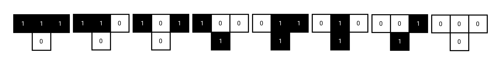

You may have noticed that there's a lot of 0s and 1s everywhere, and that this looks an awful lot like binary, the number system computers use. That's not an accident. In fact, the classification system for 1D cellular automata involves binary; the number `30` from Rule 30 is `00011110` in binary.

If you're new to binary, don't let that scare you off; we'll take the time to explain it in more detail later.

- Before that, let's do another quick exercise: now that we know that each Rule has 8 subrules, how many possible Rules are there for 1D cellular automata?

    Solution:

    Each subrule has one of two possible states. Since there are <b>8</b>. subrules, there are <b>2<sup>8</sup></b>, or <b>256</b> possible Rules.

Some of these Rules are incredibly boring. For example, Rule 0 represents a dead world; irrespective of the starting state, cells become and stay empty. Others are super interesting. Rule 110 has its own [Wikipedia page](https://en.wikipedia.org/wiki/Rule_110):

> Rule 110 is known to be Turing complete. This implies that, in principle, any calculation or computer program can be simulated using this automaton.

Isn't that wild?

<p align="center">
    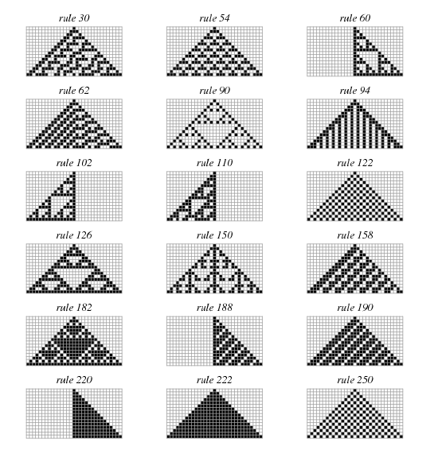
</p>

# Implementing 1D Cellular Automata

Enough background theory; let's get to coding!

Whenever you start a new programming project, it's always a good idea to think about the data you'll be working with. What shape does that data take? What transformations will you want to perform on that data, and how can you make life easy for yourself when expressing those transformations?

For our cellular automata, we're definitely going to need a way to represent a row of cells that can each have the value 0 or 1. For now, we'll represent that as a single array:

```c
#define ROW_LENGTH 5 /* We can always change this to get more/fewer cells */
int current_cell_states[ROW_LENGTH];
```

If we want to access a specific cell, we can index into it like so:

```c
/* ... */ 
int state = current_cell_states[0]; /* What is in the first cell? */
/* ... */
```

The next state of a cell depends on its current state and that of its neighbors, so let's get that information ready. Naively, we might try something like this:

```c
for (int i = 0; i < ROW_LENGTH; i++) {
	int left = current_cell_states[i-1]; /* :( */
  int curr = current_cell_states[i];
  int right = current_cell_states[i+1]; /* :( */

	/* TODO: set the new state based on the neighbors */
}
```

Unfortunately, that doesn't work. When `i` is `0`, `i-1` is `-1`, and `current_cell_states[-1]` is out of bounds. If `ROW_LENGTH` is `5`, only `0`, `1`, `2`, `3`, and `4` are valid indices:

<p align="center">
    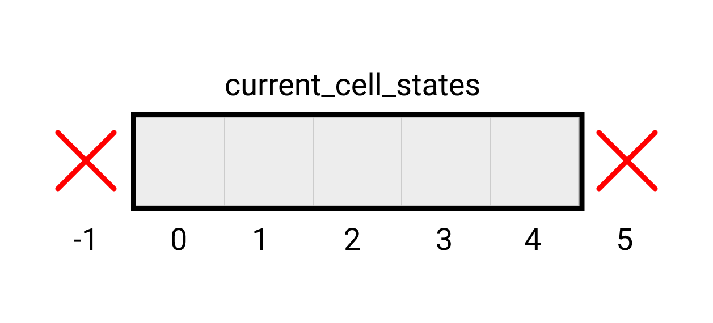
</p>

Similarly, if `i` is `4`, `i+1` is `5`, which is out of bounds in the other direction. Before we try to fix this, let's think about what our code is trying to do and what might be going wrong at either end of the array.

In general, we're moving through all of our cells, one at a time, and determining the state of that cell and the state of its left and right neighbors. Most of the time, that works great, because we have two neighbors, but at the edges of the array, it's not so clear what our neighbors should be.

This works:

<p align="center">
    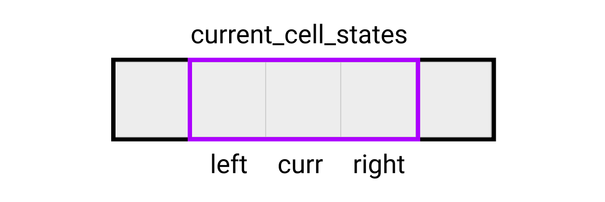
</p>

This doesn't:

<p align="center">
    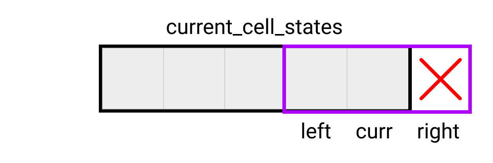
</p>

This also doesn't:

<p align="center">
    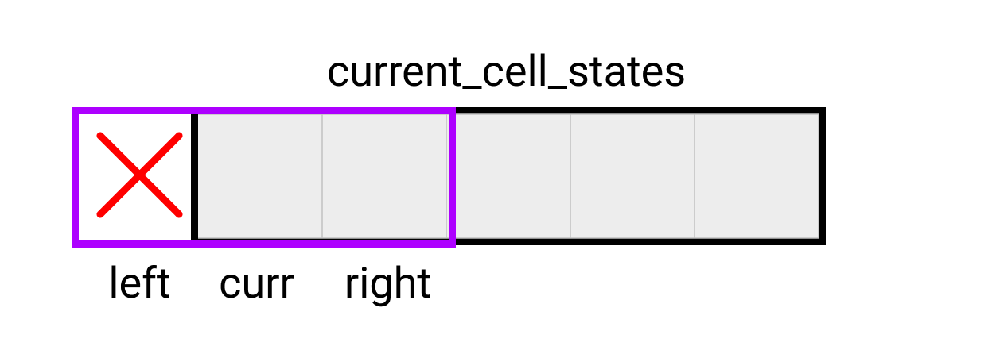
</p>

One option would be to only look at the neighbors of cells with indices between `i=1` and `i=ROW_LENGTH-2`, but that would mean that the cells at the edges can never change state. Instead, we're going to pretend that the edges wrap around; that if we look at the left neighbor of cell `i=0` we are going to get the cell at index `ROW_LENGTH-1` and if we look at the right neighbor of cell `i=ROW_LENGTH-1`, we are going to get the cell at index `0`.

Here's one way of doing that:

```c
for (int i = 0; i < ROW_LENGTH; i++) {
	int left;
	if (i == 0) {
		left = current_cell_states[ROW_LENGTH - 1];
	} else {
		left = current_cell_states[i - 1];
	}

	int curr = current_cell_states[i];

	int right;
	if (i == ROW_LENGTH - 1) {
		right = current_cell_states[0];
	} else {
	  right = current_cell_states[i + 1];
	}
  /* ... */
}
```

While that works, it's long and complicated for what it does. We can do better, using *clock arithmetic*!

## Clock Arithmetic

A clock face has the numbers 1 through 12. Most of the time, the number after the current hour mark on the clock is one higher than the previous number: we go from 10 to 11; from 11 to 12. But the mark after 12 isn't 13; it's 1 again—it wraps around, just like we need to wrap `i+1` around.

The remainder operator (`%` in C) happens to have a similar wrapping property. The remainder of 4 divided by 5 (written `4%5`),  is 4. `5%5` is 0. `6%5` is 1. For positive numbers, the result of `x%n` is always between `0` and `n-1`.

<p align="center">
    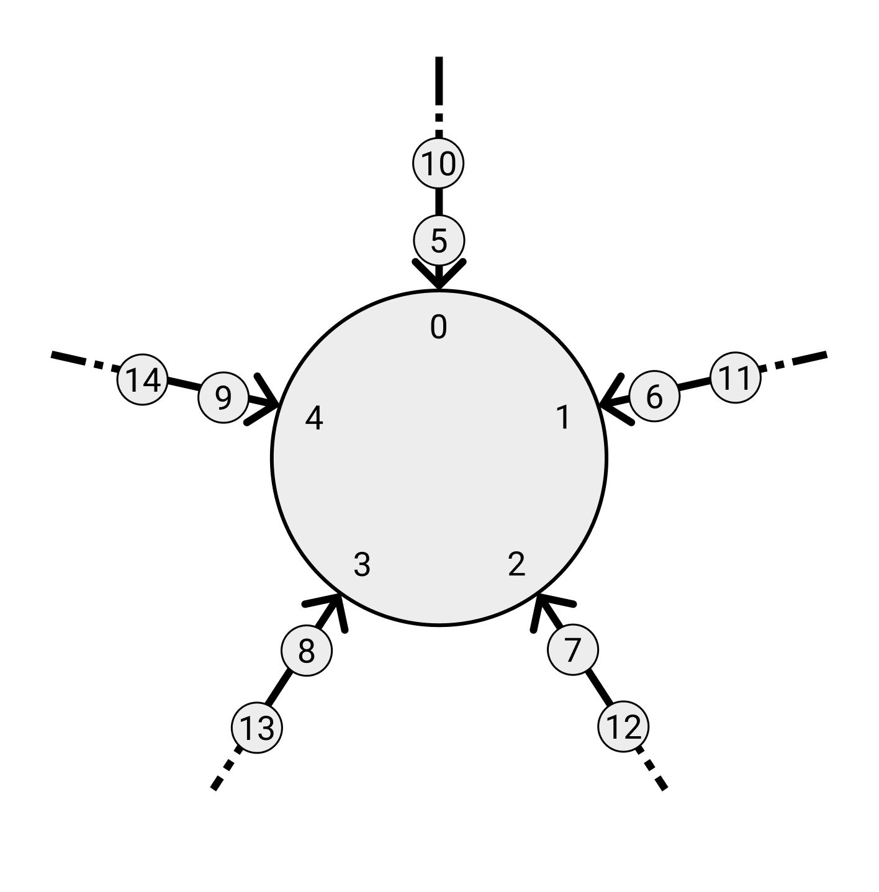
</p>

So we can rewrite

```c
int right;
if (i == ROW_LENGTH - 1) {
	right = current_cell_states[0];
} else {
  right = current_cell_states[i + 1];
}
```

as

```c
int right = current_cell_states[(i+1)%ROW_LENGTH];
```

### Wrapping around on the right with ROW_LENGTH 5
| i  | i+1                                | (i+1)%5 |
| -- | ---------------------------------- | ------- |
| 0  | 1                                  | 1       |
| 1  | 2                                  | 2       |
| 2  | 3                                  | 3       |
| 3  | 4                                  | 4       |
| 4  | <span style="color:red;">5</span>  | 0       |

<p align="center">
    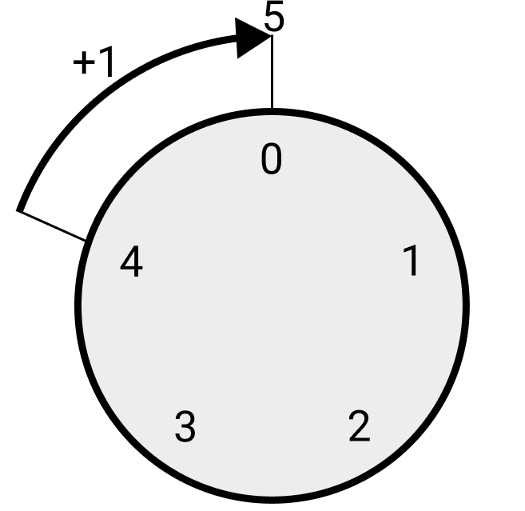
</p>

Unfortunately, `%` in C doesn't wrap negative numbers the way we'd want, so we can't write `(i-1)%ROW_LENGTH` and call it a day. `i+1` is like moving clockwise by one step on a clock, and `i-1` would be like moving counterclockwise by one step, which isn't how clocks work. However, we *could* keep going clockwise to where we would have been if we had been able to move clockwise: if you move forward by the number of numbers on the clock, you'll end up where you started.

All we need to do is add the number of numbers before wrapping:

```c
int left = current_cell_states[(i-1 + ROW_LENGTH)%ROW_LENGTH];
```

### Wrapping around on the left with ROW_LENGTH 5
| i  | i-1                                | (i-1)+5                           | ((i-1)+5)%5 |
| -- | ---------------------------------- | --------------------------------- | ----------- |
| 0  | <span style="color:red;">-1</span> | 4                                 | 4           |
| 1  | 0                                  | <span style="color:red;">5</span> | 0           |
| 2  | 1                                  | <span style="color:red;">6</span> | 1           |
| 3  | 2                                  | <span style="color:red;">7</span> | 2           |
| 4  | 3                                  | <span style="color:red;">8</span> | 3           |

<p align="center">
    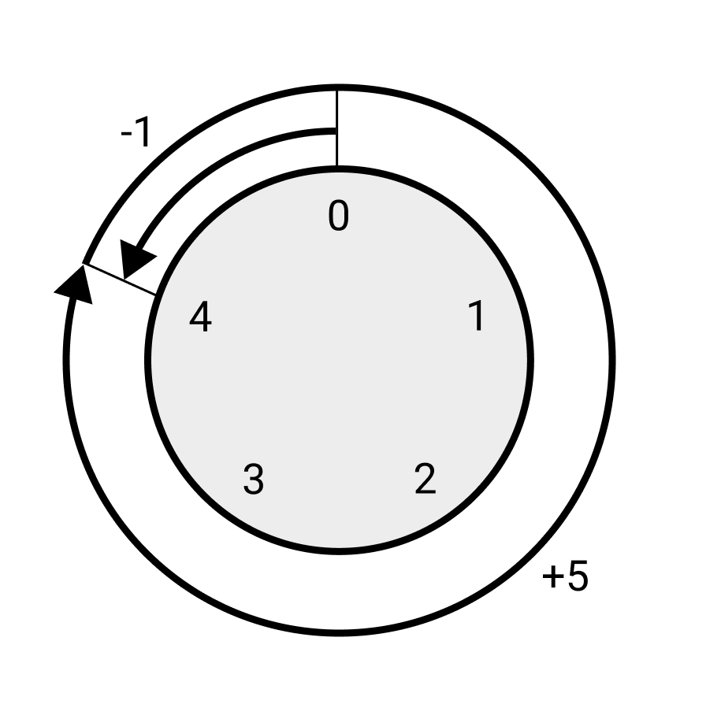
</p>

Putting all of that together, we get:

```c
for (int i = 0; i < ROW_LENGTH; i++) {
	int left = current_cell_states[((i - 1) + ROW_LENGTH) % ROW_LENGTH];
	int center = current_cell_states[i];
	int right = current_cell_states[(i + 1) % ROW_LENGTH];
  /* ... */
}
```

## State based on Time

Given that the next state of a cell is based on the current state and the state of its direct neighbors, we might be tempted to write something like this:

```c
for (int i = 0; i < ROW_LENGTH; i++) {
	int left = current_cell_states[((i - 1) + ROW_LENGTH) % ROW_LENGTH];
	int curr = current_cell_states[i];
	int right = current_cell_states[(i + 1) % ROW_LENGTH];
  
  current_cell_states[i] = nextStateBasedOnNeighbors(left, curr, right); /* :( */
}
```

Unfortunately, this doesn't work, because of time. Cell `i` at time `t` should depend on cells {`i-1`, `i`, and `i+1`} at time `t-1`. If `i` is `0`, that is indeed the case. However, with the loop above, by the time `i` becomes `1`, the left neighbor, `0`, will have already been overwritten with a value from time `t`; the information from time `t-1` there will have been lost. As `i` increases, the problem gets worse and worse:

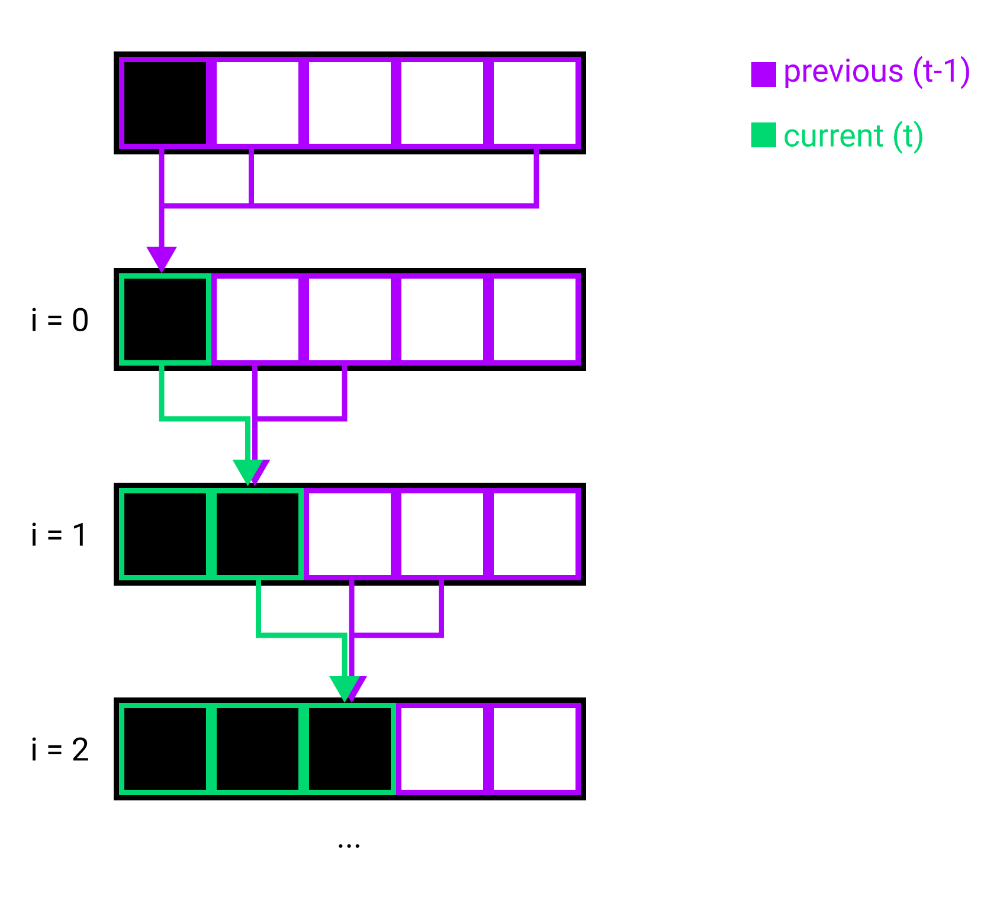

The easiest way to fix this problem is to store the states of the cells from time `t-1` separately from the cells from time `t`. Here's one way of doing that:

```c
#define ROW_LENGTH 5 /* We can always change this to get more/fewer cells */
int current_cell_states[ROW_LENGTH];
int next_cell_states[ROW_LENGTH];

void main () {
	for (int t = 0; t < 1000; t++) {
    /* Calculate the next state */
		for (int i = 0; i < ROW_LENGTH; i++) {
		  int left = current_cell_states[((i - 1) + ROW_LENGTH) % ROW_LENGTH];
		  int curr = current_cell_states[i];
		  int right = current_cell_states[(i + 1) % ROW_LENGTH];
		
		  next_cell_states[i] = stateBasedOnNeighbors(left, curr, right);
		}
		
	  /* Set the current state equal to the next state */
		for (int i = 0; i < ROW_LENGTH; i++) {
		  current_cell_states[i] = next_cell_states[i];
		}
	
	}
}
```

While this works fine, we're doing a lot of extra work to copy the new values over. We can do better, with pointers!

### A Quick Introduction to Memory Addresses and Pointers

All data used by computer programs is stored somewhere in computer memory. As a programmer you typically refer to variables using understandable names, but computers only understand numbers.

You can think of memory as a super long row of boxes containing numbers. Each box in this row has an *memory address*, a number that uniquely identifies it separately from all the other boxes:

```
Addresses   50 51 52 53 54 55 56 57 58 59 60 61 62 63 64 65 66 67
Values   ...[ ][ ][ ][ ][ ][ ][ ][ ][ ][ ][ ][ ][ ][ ][ ][ ][ ][ ]...
```

(Note that the memory addresses we're using in these examples are very small numbers; in a real program, they'll usually be many millions of times bigger.)

When you declare variables, such as `char a;`, `int b;`, or `char some_chars[5]`, you're asking the computer to reserve some memory addresses to store the values of those variables.

```
                                char some_chars[5];
    50  51  52  53  54  55  56  57  58  59  60  61  62  63  64  65  66  67
...[  ][  ][  ][  ][  ][  ][  ][  ][  ][  ][  ][  ][  ][  ][  ][  ][  ][  ]...
             ^  ^____________|  ^                ^
             a      b            some_chars[0]    some_chars[4]
```

In the diagram above, we can see that the computer reserved the address 52 for the char `a`, the four addresses 53-56 for the integer `b`, and the five addresses 57-61 for the char array `some_chars`.

When you compile a program that uses variables, the compiler replaces the human-friendly names (`a`, `b`, and `some_chars` in the example above) with the computer-friendly addresses so it can understand what you mean when you say something like `a = 5;` or `some_chars[3] = 6;`:

```
a = 5; -> Store the value 5 at memory address 52
some_chars[3] = 6; -> Store the value 6 at memory address 57+3
```

If we want to work with memory addresses in our C programs, we can use the *address of* operator, `&`. Continuing our example above, `&a` would evaluate to `52`, because the compiler decided to store `a` at address 52.

To find the value at an address, you can use the *value of* operator, `*`. For example, `*(&a)` would be 5, since the value of the `char` at address 52 is 5.

`&a == 52`
`*(&a) == 5`

Pointers provide a convenient way to refer to memory addresses. Let's look at an example:

```c
char some_char; /* 1. Declare a char variable at some address;
                      let's assume 70. For the computer,
                      some_char is synonymous with 70. */
char* some_ptr; /* 2. Declare a char pointer variable at a different address;
                      let's assume 71. For the computer,
                      some_ptr is synonymous with 71. */

some_char = 5; /* 3. Store 5 at the address to which some_char refers (70) */
some_ptr = &some_char; /* 4. Store the address of some_char (70) 
                             at the address to which some_ptr refers (71) */
/* Now *some_ptr is 5, because the value at 70 is 5 */
some_char = 8; /* 5. Store 8 at the address to which some_char refers;
                     replacing the 5 there */
/* Now *some_ptr is 8, because the value at 70 is 8 */
*some_ptr = 10; /* 6. Store 10 at address 70, replacing the 8 there.
                      Recall that the value 70 is stored at address 71. */
/* Now some_char is 10 */
```

Pointers can be confusing if you're not used to them, so let's go through the same example with a diagram for each step.

In steps 1 and 2, we declared two new variables, `some_ptr` and `some_char`. Doing that reserved space for those variables at specific memory addresses:

```c
char some_char;
char* some_ptr;
```

```
    70                71
...[  ]              [           ] ..................
     ^--some_char      ^--some_ptr
```

In step 3, we stored the value 5 in `some_char`. From the computer's perspective, we stored the value 5 at address 70:

```c
some_char = 5;
```

```
    70                71
...[ 5]              [           ] ..................
     ^--some_char      ^--some_ptr
```

In step 4, we stored the value 70 (the address of `some_char`) at address 71 (the address of `some_ptr`):

```c
some_ptr = &some_char;
```

```
    70                71
...[ 5]              [ 70         ] ..................
     ^--some_char      ^--some_ptr
```

Then we realized that `*some_ptr` is 5, because the value stored at `some_ptr` is the address 70 (`some_ptr == 70`), and the value at address 70 (which we get using the `*` operator) is 5 (`*some_ptr == 5`):

```
    70                71
...[ 5]              [ 70         ] ..................
     ^--some_char      ^--some_ptr
     ^-- *some_ptr
```

In step 5, we stored the value 8 at address 70:

```c
some_char = 8;
```

```
    70                71
...[ 8]              [ 70         ] ..................
     ^--some_char      ^--some_ptr
     ^-- *some_ptr
```

We realized that `*some_ptr` was then 8.

In step 6, we stored 10 in the location pointed to by `some_ptr`; when we write `*some_ptr =`, we're asking the computer to store a value at the address stored in `some_ptr`:

```c
*some_ptr = 10;
```

```
    70                71
...[10]              [ 70         ] ..................
     ^--some_char      ^--some_ptr
     ^-- *some_ptr
		 ^-- *(70)
```

And we discovered that `some_char` changed to 10 in the process.

### Arrays and Pointers

When we declare an array like `char my_array[5]` in C, we're simultaneously creating a readonly pointer to the first element of the array. Perhaps surprisingly, `my_array[0]` is the same as `*my_array`. Indexing into an array like this: `my_array[3]` is equivalent to doing a bit of pointer math: `*(my_array+3)`.

Let's visualize that with a memory diagram, assuming that the compiler reserved addresses 80-84 for `my_array`. From the computer's perspective, `my_array` is synonymous with address 80:

```
    80   81   82   83   84  
...[  ] [  ] [  ] [  ] [  ] ...
    ^              ^
    |              |-- *(my_array+3)
    |-- *my_array
```

In fact, the reverse is also true. If you declare a pointer like `char *my_ptr = my_array;`, you can index the array via the pointer; using the same syntax. `my_ptr[3]` is the same as `my_array[3]`. 

There's a few differences between arrays and regular pointers in C. Most notably, while you can assign a new address to a pointer (like we did with `some_ptr = &some_char;`), array names are readonly; you can't assign a new address to an array name.

### Swapping Pointers in the CA

With that digression out of the way, we can improve our cellular automaton. Our most recent code looked like this:

```c
#define ROW_LENGTH 5 /* We can always change this to get more/fewer cells */
int current_cell_states[ROW_LENGTH];
int next_cell_states[ROW_LENGTH];

void main () {
	for (int t = 0; t < 1000; t++) {
    /* Calculate the next state */
		for (int i = 0; i < ROW_LENGTH; i++) {
		  int left = current_cell_states[((i - 1) + ROW_LENGTH) % ROW_LENGTH];
		  int curr = current_cell_states[i];
		  int right = current_cell_states[(i + 1) % ROW_LENGTH];
		
		  next_cell_states[i] = stateBasedOnNeighbors(left, curr, right);
		}
		
	  /* Set the current state equal to what was the next state */
		for (int i = 0; i < ROW_LENGTH; i++) {
		  current_cell_states[i] = next_cell_states[i];
		}
	
	}
}
```

We were trying to replace this:

```c
	  /* Set the current state equal to what was the next state */
		for (int i = 0; i < ROW_LENGTH; i++) {
		  current_cell_states[i] = next_cell_states[i];
		}
```

With something that didn't need to copy a bunch of individual values. Ideally what we'd like to do is swap `current_cell_states` and `next_cell_states` all at once, with something like this:

```c
temp = current_cell_states;
current_cell_states = next_cell_states;
next_cell_states = temp;
```

As discussed in the [Arrays and Pointers](#arrays-and-pointers) section, you can't assign addresses to array names, so this doesn't work if `current_cell_states` and `next_cell_states` are arrays. But what if they're pointers instead?

```c
#define ROW_LENGTH 5
int DATA[ROW_LENGTH * 2];

int* current_cell_states;
int* next_cell_states;
int* temp;

void main () {
	current_cell_states = DATA;
	next_cell_states = DATA+ROW_LENGTH;
  ...
```

Let's look at a memory diagram, assuming `DATA` is stored at address 90, `current_cell_states` is stored at address 128, `next_cell_states` is stored at 132, and `temp` is stored at address 133. Since `current_cell_states`, `next_cell_states`, and `temp` are all pointers, the values stored in them are addresses:

```
 90    94    98    102   106   110   114   118   122   124   128   132   133
[ 0 ] [ 0 ] [ 0 ] [ 0 ] [ 0 ] [ 0 ] [ 0 ] [ 0 ] [ 0 ] [ 0 ] [90 ] [110] [   ]
 ^---- *DATA                    ^---- *(DATA+ROW_LENGTH)      ^     ^     ^--temp
 ^---- *current_cell_states     ^---- *next_cell_states       |     |
|---------- int DATA[10]; --------------------------------|   |     |-next_cell_states
                                                              |
			                                                        |---current_cell_states
```

Then we can swap `current_cell_states` and `next_cell_states` as we wanted. First we store the address referred to by `current_cell_states` in a temporary variable:

```c
temp = current_cell_states;
```

```
|---------- int DATA[10]; --------------------------------|
 90    94    98    102   106   110   114   118   122   124   128   132   133
[   ] [   ] [   ] [   ] [   ] [   ] [   ] [   ] [   ] [   ] [90 ] [110] [90 ]
 ^---- *DATA                    ^---- *(DATA+ROW_LENGTH)      ^     ^     ^--temp
 ^---- *current_cell_states     ^---- *next_cell_states       |     |
                                                              |     |-next_cell_states
                                                              |
			                                                        |---current_cell_states
```

Then we copy the address stored in `next_cell_states` into `current_cell_states`: 

```c
current_cell_states = next_cell_states;
```

```
|---------- int DATA[10]; --------------------------------| 
 90    94    98    102   106   110   114   118   122   124   128   132   133
[   ] [   ] [   ] [   ] [   ] [   ] [   ] [   ] [   ] [   ] [110] [110 ] [90 ]
 ^---- *DATA                    ^---- *(DATA+ROW_LENGTH)      ^     ^     ^--temp
                                ^---- *current_cell_states    |     |
                                ^---- *next_cell_states       |     |
                                                              |     |-next_cell_states
                                                              |
			                                                        |---current_cell_states
```

Finally, we store the old address stored in `current_cell_states` in `next_cell_states` via the copy in `temp`: 

```c
next_cell_states = temp;
```

```
|---------- int DATA[10]; --------------------------------|
 90    94    98    102   106   110   114   118   122   124   128   132   133
[   ] [   ] [   ] [   ] [   ] [   ] [   ] [   ] [   ] [   ] [110] [90 ] [90 ]
 ^---- *DATA                    ^---- *(DATA+ROW_LENGTH)      ^     ^     ^--temp
 ^---- *next_cell_states        ^---- *current_cell_states    |     |
                                                              |     |-next_cell_states
                                                              |
			                                                        |---current_cell_states
```

Now our code looks like this:

```c
#define ROW_LENGTH 5
int DATA[ROW_LENGTH * 2];

int* current_cell_states;
int* next_cell_states;
int* temp;

void main () {
	current_cell_states = DATA;
	next_cell_states = DATA+ROW_LENGTH;

	for (int t = 0; t < 1000; t++) {
	  /* Calculate the next state */
		for (int i = 0; i < ROW_LENGTH; i++) {
		  int left = current_cell_states[((i - 1) + ROW_LENGTH) % ROW_LENGTH];
		  int curr = current_cell_states[i];
		  int right = current_cell_states[(i + 1) % ROW_LENGTH];
		
		  next_cell_states[i] = stateBasedOnNeighbors(left, curr, right);
		}
		
	  /* Set the current state equal to what was the next state */
		temp = current_cell_states;
		current_cell_states = next_cell_states;
		next_cell_states = temp;
	
	}
}
```

## State Based on Neighbors

Up to this point, we've been relying on the existence of a function called `stateBasedOnNeighbors`, which, given the state of the current cell and its left and right neighbors, should return the new state of the cell by evaluating the rule of the cellular automaton. But how do we implement that function? If we're trying to implement rule 30:


we could hardcode the rule and do something like this:

```c
int stateBasedOnNeighbors (int left, int center, int right) {
  /* Evaluate Rule 30: */
	if (left == 1 && center == 1 && right == 1) { return 0; }
	else if (left == 1 && center == 1 && right == 0) { return 0; }
	else if (left == 1 && center == 0 && right == 1) { return 0; }
	else if (left == 1 && center == 0 && right == 0) { return 1; }
	else if (left == 0 && center == 1 && right == 1) { return 1; }
	else if (left == 0 && center == 1 && right == 0) { return 1; }
	else if (left == 0 && center == 0 && right == 1) { return 1; }
	else if (left == 0 && center == 0 && right == 0) { return 0; }
}
```

But what if we want to try out rule 101 instead of rule 30? With the above approach, we would need different functions for `rule30StateBasedOnNeighbors`, `rule101StateBasedOnNeighbors`, and yet more functions for any other rules we might want to explore. Could we make things easier for ourselves? Recall that each rule has the same "before" states, so the only things that would change between different rule functions implemented as above are the "after" states, the return values. Here's rule 30, again:

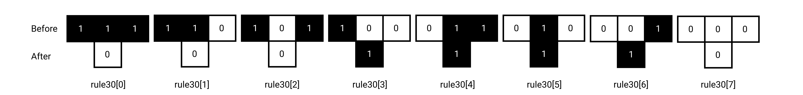

We could define the "after" states in an array, in order:

```c
int rule30[] = { 0, 0, 0, 1, 1, 1, 1, 0 };
```

Then we can look up the appropriate "after" state for a given "before" state. For example, `rule30[0]` stores `0`, which is the "after" state for the first "before" state, `111`. `rule30[6]` stores `1`, the "after" state for the seventh "before" state, `001`.

Then we can define our `stateBasedOnNeighbors` function to work with any rule:

```c
int stateBasedOnNeighbors (int* rule, int left, int center, int right) {
	if (left == 1 && center == 1 && right == 1) { return rule[0]; }
	else if (left == 1 && center == 1 && right == 0) { return rule[1]; }
	else if (left == 1 && center == 0 && right == 1) { return rule[2]; }
	else if (left == 1 && center == 0 && right == 0) { return rule[3]; }
	else if (left == 0 && center == 1 && right == 1) { return rule[4]; }
	else if (left == 0 && center == 1 && right == 0) { return rule[5]; }
	else if (left == 0 && center == 0 && right == 1) { return rule[6]; }
	else if (left == 0 && center == 0 && right == 0) { return rule[7]; }
}
```

And we could call that function by passing in the memory address of the rule array we want to try out:

```c
/* ... */

int rule30[] = { 0, 0, 0, 1, 1, 1, 1, 0 };

/* ... */

next_cell_states[i] = stateBasedOnNeighbors(rule30, left, curr, right);

/* ... */
```

We can do even better, though, with binary and bit shifting.

### A Rapid Introduction to Binary

When we're doing math on paper, we tend to use the decimal number system, which is a *base 10* number system. Base "10" means that the system uses a combination of exactly 10 different digits. The Arabic numerals `0`, `1`, `2`, `3`, `4`, `5`, `6`, `7`, `8`, and `9` are one representation of these digits.

There are many other number systems and other ways of writing digits. For example, the Sumerians developed [a base 60 number system](https://en.wikipedia.org/wiki/Sexagesimal), which influenced common ways of measuring time and angles (have you ever wondered why there are 60 seconds in a minute and 60 minutes in an hour?).

Modern computers use a much simpler number system called binary, which is a *base 2* number system that typically uses the digits `0` and `1`.

Binary and decimal are both positional number systems, which means that each digit in a number represents a value based on the position in the number as well as the value of the digit. Let's look at an example; the decimal number `501`:

`501` consists of 1 one, 0 tens, and 5 hundreds.

```
5 0 1
    ^---- 1 * 1 = 1 * 10^0 = 1
  ^------ 0 * 10 = 0 * 10^1 = 0
^-------- 5 * 100 = 5 * 10^2 = 500
```

Adding up the value of each positioned digit gives us the value of the number:

```
500 + 0 + 1 = 501
```

Binary is based around powers of 2 instead of powers of 10. Let's examine the number `1011b2` (note the `b2` suffix, which we're using here to differentiate it from the decimal number `1011`):

`1011b2` consists of 1 one, 1 two, 0 fours, and 1 eight.

```
1 0 1 1
      ^---- 1 * 1 = 1 * 2^0 = 1
    ^------ 1 * 2 = 1 * 2^1 = 2
  ^-------- 0 * 4 = 0 * 2^2 = 0
^---------- 1 * 8 = 1 * 2^3 = 8
```

Again, adding up the value of each positioned *bit* (binary digits are called bits) gives us the value of the number:

```
8 + 0 + 2 + 1 = 11
```

### Relating Binary to Cellular Automata Rules

If we look at the "after" states of a 1D cellular automaton, we can see that they resemble binary digits.


`00011110b2`

Let's convert that to decimal:

```
0 0 0 1 1 1 1 0
              ^--- 0 * 2^0 = 0
            ^----- 1 * 2^1 = 2
          ^------- 1 * 2^2 = 4
        ^--------- 1 * 2^3 = 8
      ^----------- 1 * 2^4 = 16
    ^------------- 0 * 2^5 = 0
  ^--------------- 0 * 2^6 = 0
^----------------- 0 * 2^7 = 0

0 + 0 + 0 + 16 + 8 + 4 + 2 + 0 = 30
```

That's the origin of the name "rule 30" for this particular cellular automaton.

### Using Bitwise Operations to Evaluate Subrules

Previously, we used array indexing to get the after states for a cellular automaton rule.

```c
int rule30[] = { 0, 0, 0, 1, 1, 1, 1, 0 };
```

When we used this array to represent rule 30, we were able to extract the "after" state for the fifth subrule by writing `rule30[4]`.

We can achieve the same effect by extracting a digit from the binary representation of the rule, `00011110b2`. But how do we do that in C?

The first tool we need is the *bitwise and operator*, `&`, which is similar to the logical and operator `&&` but compares each bit of two binary numbers rather than comparing two numbers as a whole. For every bit at the same position in the binary representation of two numbers, `&` produces a resulting `1` bit if both bits are `1`, and `0` in every other case. The easiest way to understand it is to see it in action:

```
  01101b2
& 10101b2
---------
= 00101b2
```

Let's use `&` to try extracting a specific bit from rule 30 expressed in binary: `00011110b2`.

```
00011110b2
    ^------- We want to write C code that determines whether this bit is 0 or 1
```

We might start by producing a number that has a "high" bit (a `1`) in the corresponding position, and "low" bits (`0`) everywhere else, and using `&` to discard the digits we don't care about:

```
  00011110b2
& 00001000b2
-------------
  00001000b2
```

The `00001000b2` we used here is an example of a "bit mask". We are using it to "mask out" every bit we don't care about, and leave the ones we do care about intact.

If there had been a `0` at the same position in the rule (rule 22, `00010110b2`), we would have gotten this instead:

```
  00010110b2
& 00001000b2
-------------
  00000000b2
```

When `&`ing a rule with `00001000b2` as in the above examples, we could either get `00001000b2` (16 in decimal) or `00000000b2` (0 in decimal), but what we want to get is one of `00000001b2` (1 in decimal) and `00000000b2` (0 in decimal).

We could use yet another `if` statement to differentiate the two, but we can do a better job using *bitshifting*.

The bitshift operators in C, `<<` and `>>`, "shift" all of the bits that make up a number to the left or right by a specified amount, filling in the missing spots with `0`s. Here's an example:

```
00101011b2 >> 2
---------------
00001010~~11~~
---------------
00001010b2
```

And in the other direction:

```
    00101011b2 << 3
-------------------
 00101011000
-------------------
 00101011000b2
```

Using bitshifting in combination with the `&` operator allows us to extract a specific bit from a number:

```
00011110b2
    ^---------- We want to get whether this is 0 or 1, so shift it right:

00011110b2 >> 3
----------------
00000011~~110~~
----------------
00000011b2
       ^---------- We want to get whether this is 0 or 1, so use &:

  00000011b2
& 00000001b2
--------------
  00000001b2
```

Here's another example, getting a low bit this time:

```
00011110b2
  ^---------- We want to get whether this is 0 or 1, so shift it right:

00011110b2 >> 5
----------------
00000000~~11110~~
----------------
00000000b2
       ^---------- We want to get whether this is 0 or 1, so use &:

  00000000b2
& 00000001b2
--------------
  00000000b2
```

We can use this technique to rewrite our `stateBasedOnNeighbors` function, eliminating the need for an array:

```c
int stateBasedOnNeighbors (int rule, int left, int center, int right) {
	if (left == 1 && center == 1 && right == 1) { return (rule >> 7) & 1; }
	else if (left == 1 && center == 1 && right == 0) { return (rule >> 6) & 1; }
	else if (left == 1 && center == 0 && right == 1) { return (rule >> 5) & 1; }
	else if (left == 1 && center == 0 && right == 0) { return (rule >> 4) & 1; }
	else if (left == 0 && center == 1 && right == 1) { return (rule >> 3) & 1; }
	else if (left == 0 && center == 1 && right == 0) { return (rule >> 2) & 1; }
	else if (left == 0 && center == 0 && right == 1) { return (rule >> 1) & 1; }
	else if (left == 0 && center == 0 && right == 0) { return (rule) & 1; }
}
```

There's one last change we can make to compress this code even further. Let's take another look at the "before" states of 1D cellular automaton rules:


`111b2` is the decimal number `7`. `110b2` is the decimal number `6`. The subrules are arranged such that the before states count down from `7` to `0`. If we take a look at the `if` statements we have, we can see that the amount of each shift is equal to the binary representation of the before state in the condition. Consider

```c
if (left == 1 && center == 0 && right == 1) { return (rule >> 5) & 1; }
```

 for example. `left == 1 && center == 0 && right == 1` is the condition, which tests for the before state `101b2`. `101b2` is the binary representation of the decimal number `5`, which is the amount of the shift: `rule >> 5`. If we can take advantage of this, we can replace all the `if` statements with a single expression:

```c
return (rule >> makeBinaryNumber(left,center,right)) & 1;
```

But how can we implement the behavior `makeBinaryNumber`? We want to construct a binary number from 3 numbers representing its bits. We want a number `LCRb2` where the bits `L`, `C`, and `R` correspond to `left`, `center`, and `right`. Let's start with bitshifting again. We want `left` to be shifted to the left by 2 digits, `center` to be shifted to the left by 1 digit, and `right` to remain unchanged:

```c
LCR
  ^----- right
 ^------ center << 1
^------- left << 2
```

But if we have numbers like `100b2`, `000b2`, and `001b2`, how can we combine them together to make `101b2`? We can't use `&` because it would discard all the `1`s. `1 & 0 == 0`.

Luckily, there's another bitwise operator we can use, `|`, the *bitwise or* operator. Like `&`, `|` compares corresponding bits in the binary representation of two numbers and produces a result. However, `|` produces a `1` if *either* of the bits are `1`. It only produces `0` if both bits are `0`. Here's an example:

```
  01101b2
| 10101b2
---------
= 11101b2
```

And another:

```
  100b2
| 000b2
| 001b2
--------
  101b2
```

We can use `|` to combine `left`, `right`, and `center`:

```
left << 2 | center << 1 | right
```

Using that expression, we can rewrite our `stateBasedOnNeighbors` function to be super concise:

```c
int stateBasedOnNeighbors (int rule, int left, int center, int right) {
	return (rule >> (left << 2 | center << 1 | right)) & 1;
}
```

## Bringing Everything Together

Our code now looks like this:

```c
#define CURRENT_RULE 30
#define ROW_LENGTH 5
int DATA[ROW_LENGTH * 2];

int* current_cell_states;
int* next_cell_states;
int* temp;

int stateBasedOnNeighbors (int rule, int left, int center, int right) {
	return (rule >> (left << 2 | center << 1 | right)) & 1;
}

void main () {
	current_cell_states = DATA;
	next_cell_states = DATA+ROW_LENGTH;

	for (int t = 0; t < 1000; t++) {
	  /* Calculate the next state */
		for (int i = 0; i < ROW_LENGTH; i++) {
		  int left = current_cell_states[((i - 1) + ROW_LENGTH) % ROW_LENGTH];
		  int curr = current_cell_states[i];
		  int right = current_cell_states[(i + 1) % ROW_LENGTH];
		
		  next_cell_states[i] = stateBasedOnNeighbors(CURRENT_RULE, left, curr, right);
		}
		
	  /* Set the current state equal to what was the next state */
		temp = current_cell_states;
		current_cell_states = next_cell_states;
		next_cell_states = temp;
	
	}
}
```

Let's add an initial state and some output so we can see the 1D cellular automaton in action:

```c
#include <stdio.h>

#define CURRENT_RULE 30
#define ROW_LENGTH 80
int DATA[ROW_LENGTH * 2];

int* current_cell_states;
int* next_cell_states;
int* temp;

int stateBasedOnNeighbors (int rule, int left, int center, int right) {
	return (rule >> (left << 2 | center << 1 | right)) & 1;
}

int main (void) {
	current_cell_states = DATA;
	next_cell_states = DATA+ROW_LENGTH;

  /* Start with a 1 cell in the middle */
  current_cell_states[ROW_LENGTH/2] = 1;

	for (int t = 0; t < 1000; t++) {
    /* Display the current state */
		for (int i = 0; i < ROW_LENGTH; i++) {
      printf("%c", current_cell_states[i]? '#' : '.');
    }
    printf("\n");
		
    /* Calculate the next state */
		for (int i = 0; i < ROW_LENGTH; i++) {
		  int left = current_cell_states[((i - 1) + ROW_LENGTH) % ROW_LENGTH];
		  int curr = current_cell_states[i];
		  int right = current_cell_states[(i + 1) % ROW_LENGTH];
		
		  next_cell_states[i] = stateBasedOnNeighbors(CURRENT_RULE, left, curr, right);
		}
		
	  /* Set the current state equal to what was the next state */
		temp = current_cell_states;
		current_cell_states = next_cell_states;
		next_cell_states = temp;
	}

    return 0;
}
```

Here's `CURRENT_RULE 30` `ROW_LENGTH 80`:

```c
........................................#.......................................
.......................................###......................................
......................................##..#.....................................
.....................................##.####....................................
....................................##..#...#...................................
...................................##.####.###..................................
..................................##..#....#..#.................................
.................................##.####..######................................
................................##..#...###.....#...............................
...............................##.####.##..#...###..............................
..............................##..#....#.####.##..#.............................
.............................##.####..##.#....#.####............................
............................##..#...###..##..##.#...#...........................
...........................##.####.##..###.###..##.###..........................
..........................##..#....#.###...#..###..#..#.........................
.........................##.####..##.#..#.#####..#######........................
........................##..#...###..####.#....###......#.......................
.......................##.####.##..###....##..##..#....###......................
......................##..#....#.###..#..##.###.####..##..#.....................
.....................##.####..##.#..######..#...#...###.####....................
....................##..#...###..####.....####.###.##...#...#...................
...................##.####.##..###...#...##....#...#.#.###.###..................
..................##..#....#.###..#.###.##.#..###.##.#.#...#..#.................
.................##.####..##.#..###.#...#..####...#..#.##.######................
................##..#...###..####...##.#####...#.#####.#..#.....#...............
...............##.####.##..###...#.##..#....#.##.#.....#####...###..............
..............##..#....#.###..#.##.#.####..##.#..##...##....#.##..#.............
.............##.####..##.#..###.#..#.#...###..####.#.##.#..##.#.####............
............##..#...###..####...####.##.##..###....#.#..####..#.#...#...........
...........##.####.##..###...#.##....#..#.###..#..##.####...###.##.###..........
..........##..#....#.###..#.##.#.#..#####.#..######..#...#.##...#..#..#.........
.........##.####..##.#..###.#..#.####.....####.....####.##.#.#.#########........
........##..#...###..####...####.#...#...##...#...##....#..#.#.#........#.......
.......##.####.##..###...#.##....##.###.##.#.###.##.#..#####.#.##......###......
......##..#....#.###..#.##.#.#..##..#...#..#.#...#..####.....#.#.#....##..#.....
.....##.####..##.#..###.#..#.####.####.#####.##.#####...#...##.#.##..##.####....
....##..#...###..####...####.#....#....#.....#..#....#.###.##..#.#.###..#...#...
...##.####.##..###...#.##....##..###..###...######..##.#...#.###.#.#..####.###..
..##..#....#.###..#.##.#.#..##.###..###..#.##.....###..##.##.#...#.####....#..#.
.##.####..##.#..###.#..#.####..#..###..###.#.#...##..###..#..##.##.#...#..######
.#..#...###..####...####.#...######..###...#.##.##.###..######..#..##.#####.....
######.##..###...#.##....##.##.....###..#.##.#..#..#..###.....######..#....#....
#......#.###..#.##.#.#..##..#.#...##..###.#..##########..#...##.....####..###..#
.#....##.#..###.#..#.####.###.##.##.###...####.........####.##.#...##...###..###
.##..##..####...####.#....#...#..#..#..#.##...#.......##....#..##.##.#.##..###..
##.###.###...#.##....##..###.###########.#.#.###.....##.#..#####..#..#.#.###..#.
#..#...#..#.##.#.#..##.###...#...........#.#.#..#...##..####....######.#.#..###.
#####.#####.#..#.####..#..#.###.........##.#.#####.##.###...#..##......#.####...
```

And here's `CURRENT_RULE 101` `ROW_LENGTH 80`:

```
........................................#.......................................
#######################################.#.######################################
......................................####......................................
#####################################....#.#####################################
....................................#.##.##.....................................
###################################.##.##.#.####################################
..................................##.##.####....................................
#################################..##.##...#.###################################
................................#...##.#.#.##...................................
###############################.#.#..######.#.##################################
..............................#####.......####..................................
#############################.....#.#####....#.#################################
............................#.###.##....#.##.##.................................
###########################.##..##.#.##.##.##.#.################################
..........................##.#...####.##.##.####................................
#########################..###.#....##.##.##...#.###############################
........................#....###.##..##.##.#.#.##...............................
#######################.#.##...##.#...##.######.#.##############################
......................####.#.#..###.#..##.....####..............................
#####################....#####....###...#.###....#.#############################
....................#.##.....#.##...#.#.##..#.##.##.............................
###################.##.#.###.##.#.#.####.#..##.##.#.############################
..................##.####..##.######...###...##.####............................
#################..##...#...##.....#.#...#.#..##...#.###########################
................#...#.#.#.#..#.###.###.#.###...#.#.##...........................
###############.#.#.#######..##..##..####..#.#.####.#.##########################
..............######......#...#...#.....#..####...####..........................
#############......#.####.#.#.#.#.#.###.#.....#.#....#.#########################
............#.####.##...############..###.###.###.##.##.........................
###########.##...##.#.#............#....##..##..##.##.#.########################
..........##.#.#..#####.##########.#.##..#...#...##.####........................
#########..#####......##.........####.#..#.#.#.#..##...#.#######################
........#......#.####..#.#######....###..#######...#.#.##.......................
#######.#.####.##...#..##......#.##...#........#.#.####.#.######################
......####...##.#.#.#...#.####.##.#.#.#.######.####...####......................
#####....#.#..#######.#.##...##.########.....##...#.#....#.#####################
....#.##.###........####.#.#..##.......#.###..#.#.###.##.##.....................
###.##.##..#.######....#####...#.#####.##..#..####..##.##.#.####################
..##.##.#..##.....#.##.....#.#.##....##.#..#.....#...##.####....................
#..##.###...#.###.##.#.###.####.#.##..###..#.###.#.#..##...#.###################
#...##..#.#.##..##.####..##...####.#....#..##..#####...#.#.##...................
#.#..#..####.#...##...#...#.#....###.##.#...#......#.#.####.#.#################.
###..#.....###.#..#.#.#.#.###.##...##.###.#.#.####.####...####................##
..#..#.###...###..########..##.#.#..##..######...##...#.#....#.##############...
#.#..##..#.#...#.........#...#####...#.......#.#..#.#.###.##.##.............#.##
###...#..###.#.#.#######.#.#.....#.#.#.#####.###..####..##.##.#.###########.##..
..#.#.#....######......#####.###.######....##..#.....#...##.####..........##.#..
#.#####.##......#.####.....##..##.....#.##..#..#.###.#.#..##...#.########..###.#
##....##.#.####.##...#.###..#...#.###.##.#..#..##..#####...#.#.##.......#....##.
.#.##..####...##.#.#.##..#..#.#.##..##.###..#...#......#.#.####.#.#####.#.##..##
###.#.....#.#..######.#..#..####.#...##..#..#.#.#.####.####...####....####.#...#
..###.###.###.......###..#.....###.#..#..#..######...##...#.#....#.##....###.#..
#...##..##..#.#####...#..#.###...###..#..#.......#.#..#.#.###.##.##.#.##...###.#
#.#..#...#..##....#.#.#..##..#.#...#..#..#.#####.###..####..##.##.####.#.#...##.
###..#.#.#...#.##.#####...#..###.#.#..#..##....##..#.....#...##.##...#####.#..##
```

